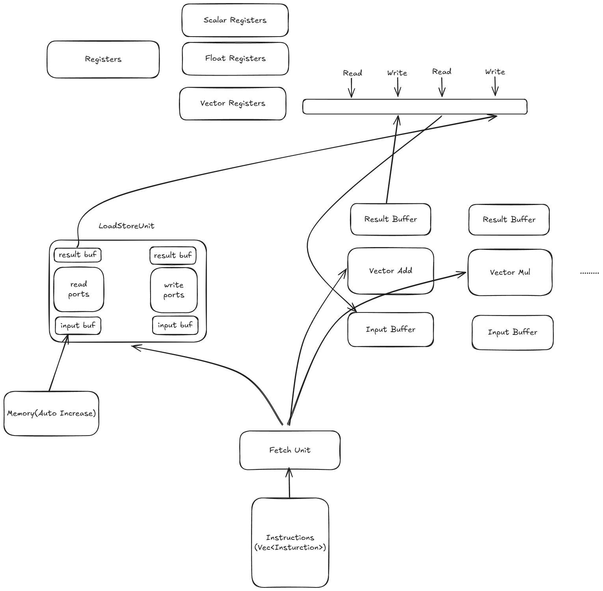

          
# RISC-V Vector Simulator

## Architecture Design



### Overview

The RISC-V Vector Simulator is a tool designed to simulate the RISC-V vector extension instruction set architecture. Developed in Rust, this simulator aims to provide a flexible and efficient platform for testing and validating the execution of RISC-V vector instructions.

### Core Components

#### Simulator

The simulator serves as the main control unit of the system, coordinating interactions between various components. It includes the following major components:

- Fetch Unit
- Function Units
- Memory Unit
- Register File

#### Fetch Unit

The Fetch Unit is responsible for retrieving instructions from instruction memory and passing them to the appropriate function units for processing. It maintains the program counter (PC) and manages the instruction flow.

```rust
pub struct Fetch {
    pc : usize,
    inst_memory : Vec<riscv_isa::Instruction>
}
```

#### Function Units

Function Units execute various types of instructions, including:

- Integer ALU: Performs integer arithmetic and logical operations
- Integer Multiplier: Performs integer multiplication operations
- Float ALU: Performs floating-point arithmetic and logical operations
- Float Multiplier: Performs floating-point multiplication operations

Each function unit has specific latency configurations that can be set in the configuration file.

#### Memory Unit

The Memory Unit handles all memory access operations, including load and store instructions. It supports vector memory operations, allowing multiple data elements to be loaded or stored at once.

#### Register File

The Register File contains scalar registers and vector registers:

- Scalar Registers: Store individual data values
- Vector Registers: Store vector data, supporting variable-length vector operations

```rust
pub struct VectorRegister {
    pub id : RegisterIdType,
    pub total_bytes : u32,
    pub write_count : u32,
    pub read_count : u32,
    pub current_index : usize,
    pub task_queue : VecDeque<RegisterTask>
}
```

### Data Flow

1. The Fetch Unit retrieves instructions from instruction memory
2. Instructions are decoded and dispatched to the appropriate Function Unit or Memory Unit
3. Function Units execute instructions and update the Register File
4. The Memory Unit handles memory access operations
5. The Simulator coordinates the operations of all components, ensuring instructions are executed in the correct order

### Buffer System

The simulator implements a buffer system to manage the flow of instructions and data. This helps simulate pipeline and out-of-order execution features found in modern processors.

### Simulation Cycle

The simulator executes instructions in cycles, with multiple instructions potentially executing in each cycle depending on available function units and resources. The main steps of the simulation loop are as follows:

```rust
pub fn main_sim_loop(&mut self) -> anyhow::Result<()> { 
    let mut total_cycle : u32 = 0;
    let max_cycles : u32 = 100; // Set maximum cycle count
    debug!("Starting main simulation loop");
    
    while !self.is_simulation_end() && total_cycle < max_cycles { 
        // Simulation execution
        total_cycle += 1;
    }
    Ok(())
}
```

### Configuration Options

The simulator provides rich configuration options that can be set through a configuration file:

- Function Unit Configuration: Set latency and quantity for various function units
- Memory Unit Configuration: Set memory access latency and bandwidth
- Vector Configuration: Set vector length, element width, and lane count
- Register Configuration: Set register file size and port count

```toml
[function_units.interger_alu]
latency = 1 # The arithmetic logic unit usually has low latency.

[function_units.interger_multiplier]
latency = 3

[function_units.float_alu]
latency = 3

[function_units.float_multiplier]
latency = 6 
```

## Current Limitations

Vector Mask is not currently implemented.

## Future Work

- Implement Vector Mask support
- Optimize performance and memory usage
- Add support for more vector instructions
- Improve debugging and visualization capabilities

## Usage

### Simple Example

```bash
cargo run -- -i appendix/_chaintest/bin/chaintest -c ./config.toml -s 0x1023c -e 0x10248
```

### Command Line Arguments

- `-i, --input`: Path to the RISC-V binary
- `-c, --config`: Path to the configuration file
- `-s, --start_addr`: Start address of the region to simulate (hex)
- `-e, --end_addr`: End address of the region to simulate (hex)
- `-v, --verbose`: Verbose output
        